# Supplementary code for Sparse Concept Bottleneck Models: Gumbel tricks in Contrastive Learning

## How to install
```bash
git clone -b rebuttal https://github.com/icml24/SparseCBM
cd SparseCBM
pip install -r requirements.txt
```
## Repository structure
* <ins>additional_evaluations</ins> contains training examples of CBMs, evaluation of CMS, concepts generation and latent space visualization.
* In <ins>bottleneck</ins> you may find a code for: our model, key objective functions, training utilities and a setup for CMS.
* Use <ins>data</ins> to look through the concept sets and class labels we use.
* Please, run ```demo.ipynb``` in <ins>demo_notebooks</ins> to train your own CBM with any hyperparameters you need and any of the datasets provided. We suggest you to use CUB200 examples, for simplicity, and train with a small learning rates both of B/32 and L/14 configurations (CBMs are sensitive to lrs). A simple 10 epochs example with CLIP-ViT-B/32 backbone is already presented in demo, but feel free to adjust more changes.
* See <ins>experiments</ins> to verify our results for the rebuttal. Here we included both Linear Probing and Zero-shot inference of the CLIP-ViT-L/14 model. Along with it, we show an interpretability proxy, by comparing CBL activation with CLIP outputs.
## New experimental results
We report with the additional results on interpretability and final classification accuracy. 
1) General accuracy tables for CBM and CMS:

|  Model   |CIFAR10| CIFAR100 |ImageNet | CUB 200 | Places365  |
|---------|------|--------|-----|---|-----|
|Sparse-CBM (Ours)|  **91.17%**    |  **74.88%**   |71.61%| **80.02%**|41.34%|
|$\ell_1$-CBM (Ours) |   85.11%    |73.24%|71.02%| 74.91% |40.87%|
| Contrastive-CBM  |   84.75%   |  68.46%   | 70.22%  |  67.04%   |  40.22%  |   
| Label-free CBM  |   86.40%   |   65.13%   |  **71.95%** |  74.31%   |  **43.68%**  |  
| Post-hoc CBM (CLIP)  |   83.34%    |  57.20%    |  62.57%  |   63.92%  |  39.66%  |   
| LaBo (full-supervised) |   87.90%   |  69.10%    |  70.40% |   71.80%  |  39.43%  | 
|----------------------|-------|--------|--------|--------|--------|
| Linear Probing |   96.12%   |  80.03%   | 83.90%  |   79.29%  |  48.33%  | 

|  Model   |CIFAR10| CIFAR100 |ImageNet | CUB 200 | Places365  |
|---------|------|--------|-----|---|-----|
|Concept Matrix Search (Ours)|   **85.03%**   |  62.95%   |**77.82%**| **65.17%** |39.43%|
|DescriptionCLS         |   81.61%     |**68.32%**|75.00%| 63.46% |40.55%|
| Zero-shot CLIP-ViT-L/14 |   81.79%   |   52.84%  |  76.20% |   62.63%  |   **41.12%** |  
3) For interpretability, we show a comparison between concepts extracted by CBM variant and backbone CLIP model:

<p align="center"><strong>Concepts extracted by Sparse-CBM (Ours)</strong></p>

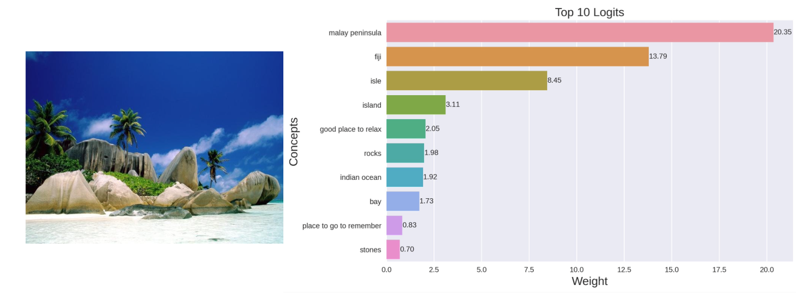

<p align="center"><strong>Concepts extracted by $\ell_1$-CBM (Ours)</strong></p>

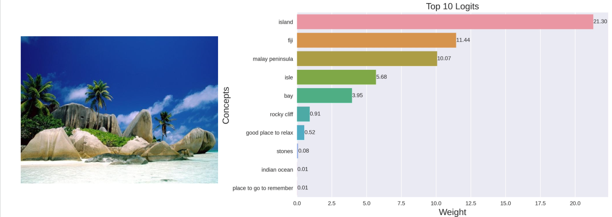

<p align="center"><strong>Concepts extracted by Contrastive-CBM (Ours)</strong></p>

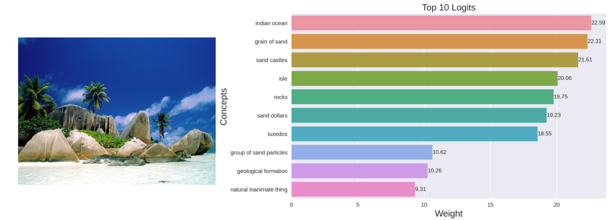

<p align="center"><strong>Concepts extracted by CLIP</strong></p>

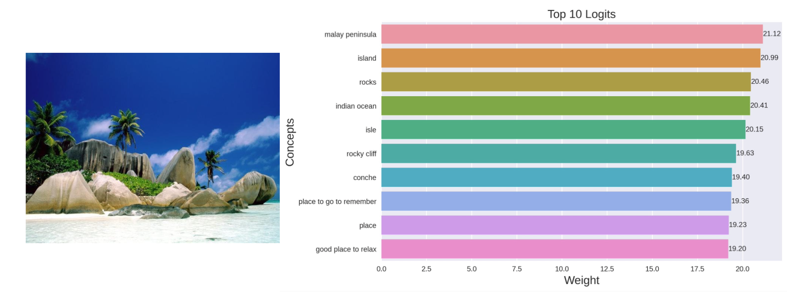

<p align="center"><strong>Concepts extracted by Sparse-CBM (Ours)</strong></p>

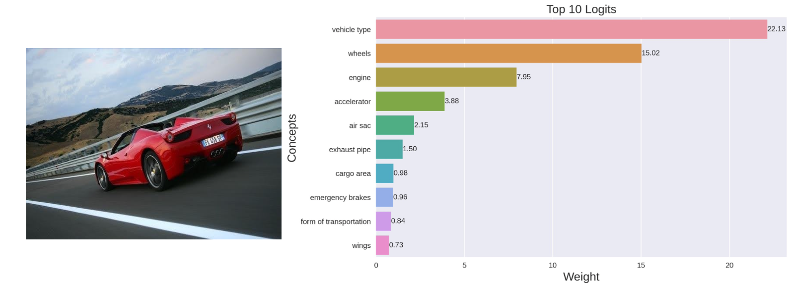

<p align="center"><strong>Concepts extracted by $\ell_1$-CBM (Ours)</strong></p>

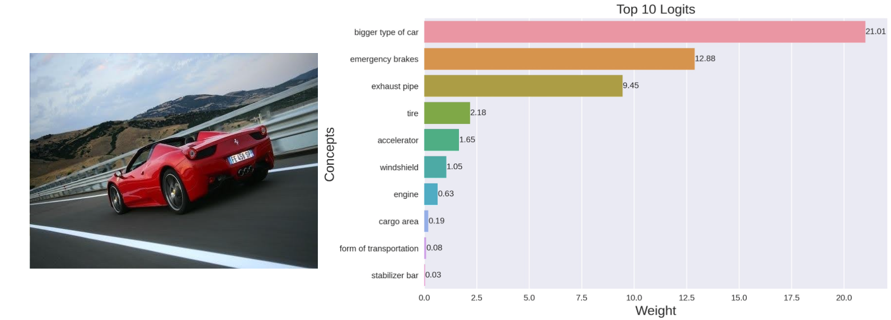

<p align="center"><strong>Concepts extracted by Contrastive-CBM (Ours)</strong></p>


<p align="center"><strong>Concepts extracted by CLIP</strong></p>

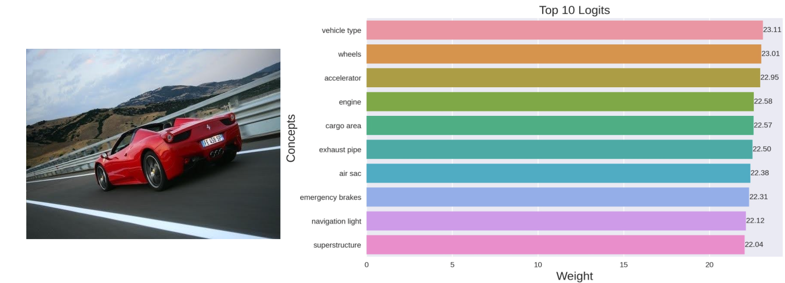

<p align="center"><strong>Concepts extracted by Sparse-CBM (Ours)</strong></p>

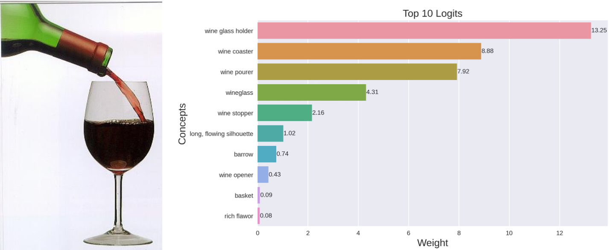

<p align="center"><strong>Concepts extracted by $\ell_1$-CBM (Ours)</strong></p>

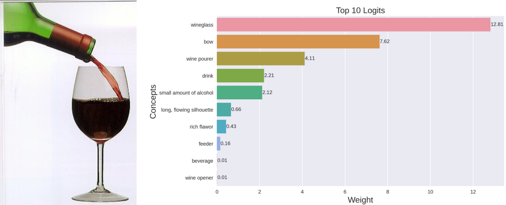

<p align="center"><strong>Concepts extracted by Contrastive-CBM</strong></p>

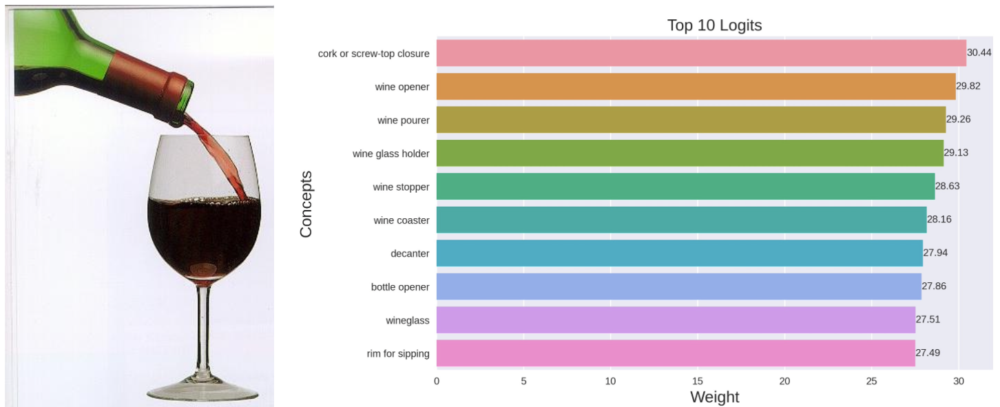

<p align="center"><strong>Concepts extracted by CLIP</strong></p>

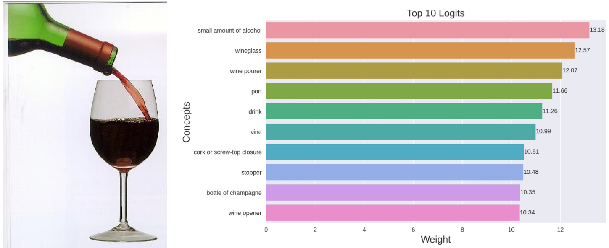

## Implementation details
To run our ```BottleneckTrainer``` you should create an appropriate ```CBMConfig``` instance and prepare dataloaders as in the ```demo.ipynb```. Next, we provide a mock example of how the CBM training starts:
```python
from configs import *
from trainer_utils import *

config = CBMConfig(
    num_nets=3,
    num_concepts=len(concepts),
    num_classes=200,
    run_name="demo_run",
    net_types=["base", "base", "base"],
    backbones=[Constants.clip_large_link, Constants.clip_large_link, Constants.clip_large_link],
    displayed_names=["model no 1", "model no 2", "model no 3"],
    training_methods=["gumbel", "contrastive", "l1"],
    optimizers=["SGD", "Adam", "AdamW"],
    lrs=[1e-3, 3e-4, 3e-4],
    cbl_lrs=[1e-3, 3e-4, 3e-4],
    train_backbones=[False, False, True],
)

trainer = BottleneckTrainer(
    config,
    train_loader,
    val_loader,
    test_loader,
    num_epochs=10,
    device=device,
)

trainer.train()
trainer.test()
```
If you would like to record the interpretability of the trained CBM, feel free to check the overall metrics and play with several images similarly to ```interpret.ipynb``` and ```cub_interpret.ipynb```.
```python
plot_trainer_metrics(trainer.hist)
```
```python
image = PIL.Image.open("my_image.jpg")
processor = transformers.CLIPProcessor.from_pretrained(Constants.clip_large_link)

scores = cbm_interpretability_scores(trainer.nets[0], processor, concepts, image, device)
draw_bottleneck(image, scores, k=10, concepts=concepts, draw_probs=False)
```
**We believe the details provided are clear enough to reproduce the main findings of our paper.**

