
<strong>Concepts extracted by Sparse-CBM (Ours)</strong>

<strong>Concepts extracted by $\ell_1$-CBM (Ours)</strong>

<strong>Concepts extracted by Contrastive-CBM (Ours)</strong>

<strong>Concepts extracted by CLIP</strong>

<strong>Concepts extracted by Sparse-CBM (Ours)</strong>

<strong>Concepts extracted by $\ell_1$-CBM (Ours)</strong>

<strong>Concepts extracted by Contrastive-CBM (Ours)</strong>

<strong>Concepts extracted by CLIP</strong>

<strong>Concepts extracted by Sparse-CBM (Ours)</strong>

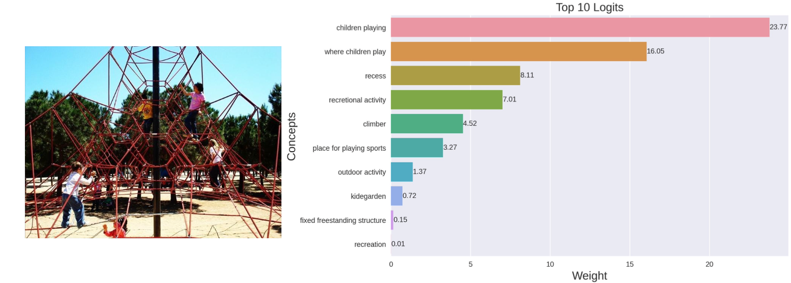

<strong>Concepts extracted by $\ell_1$-CBM (Ours)</strong>

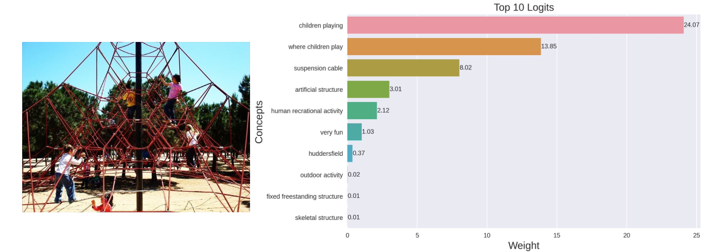

<strong>Concepts extracted by Contrastive-CBM (Ours)</strong>

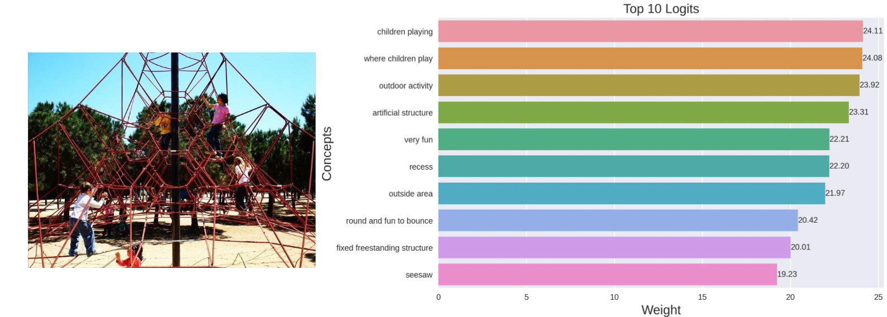

<strong>Concepts extracted by CLIP</strong>

<strong>Concepts extracted by Sparse-CBM (Ours)</strong>

<strong>Concepts extracted by $\ell_1$-CBM (Ours)</strong>

<strong>Concepts extracted by Sparse-CBM (Ours)</strong>

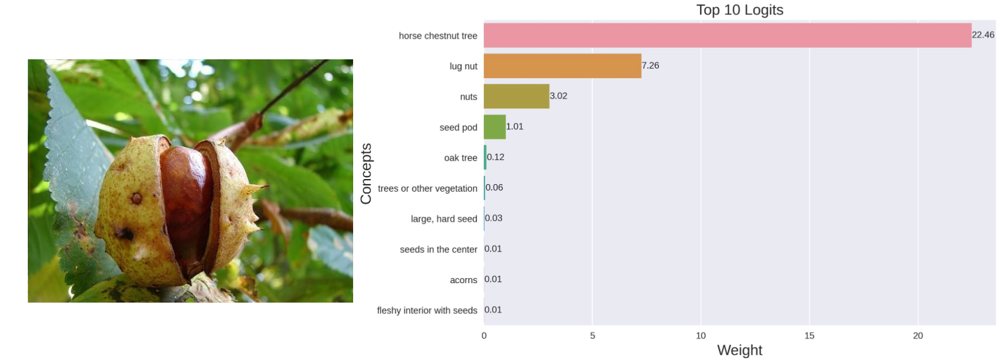

<strong>Concepts extracted by $\ell_1$-CBM (Ours)</strong>

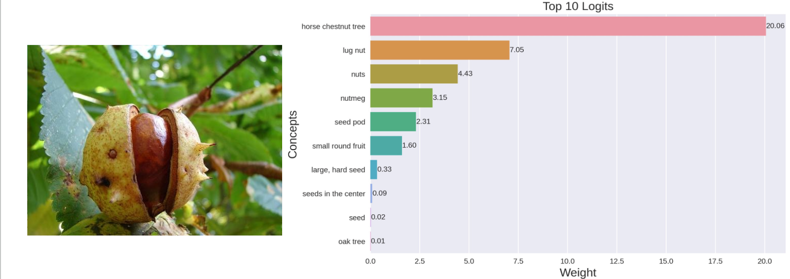

<strong>Concepts extracted by Contrastive-CBM (Ours)</strong>

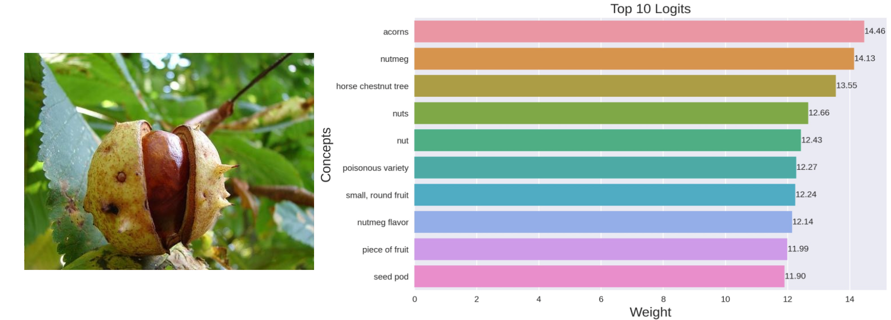

<strong>Concepts extracted by CLIP</strong>

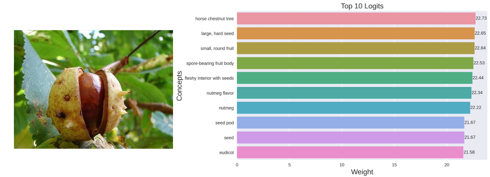

<strong>Concepts extracted by Sparse-CBM (Ours)</strong>

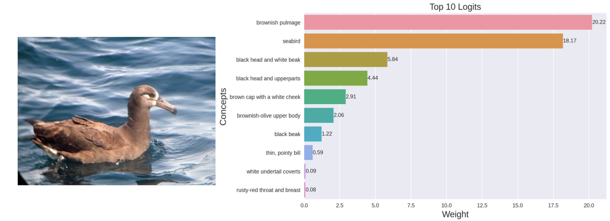

<strong>Concepts extracted by $\ell_1$-CBM (Ours)</strong>

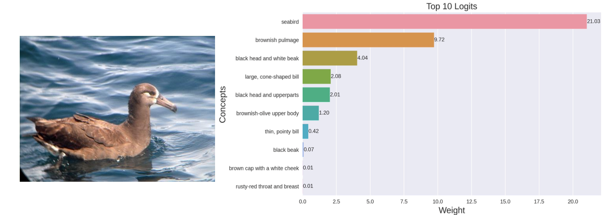

<strong>Concepts extracted by Contrastive-CBM (Ours)</strong>

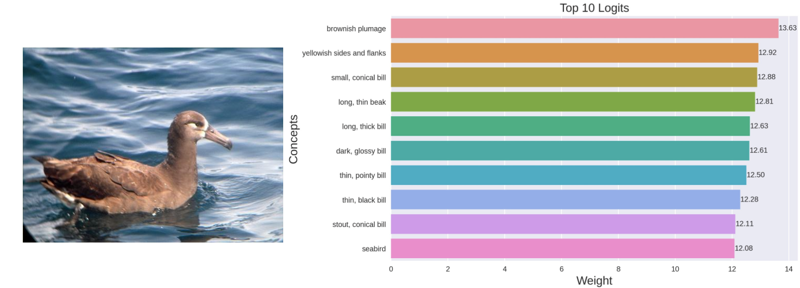

<strong>Concepts extracted by CLIP</strong>

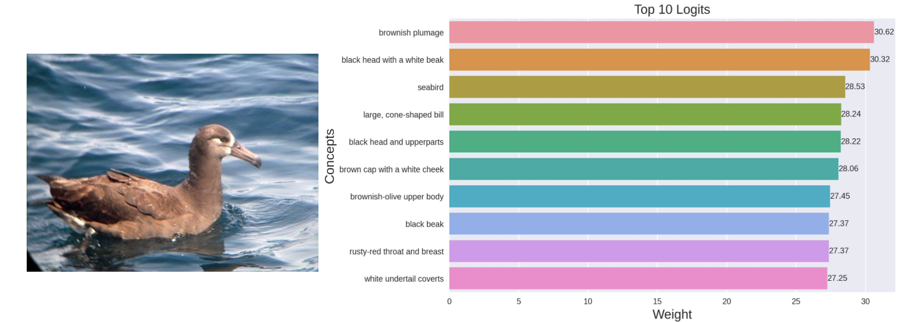
